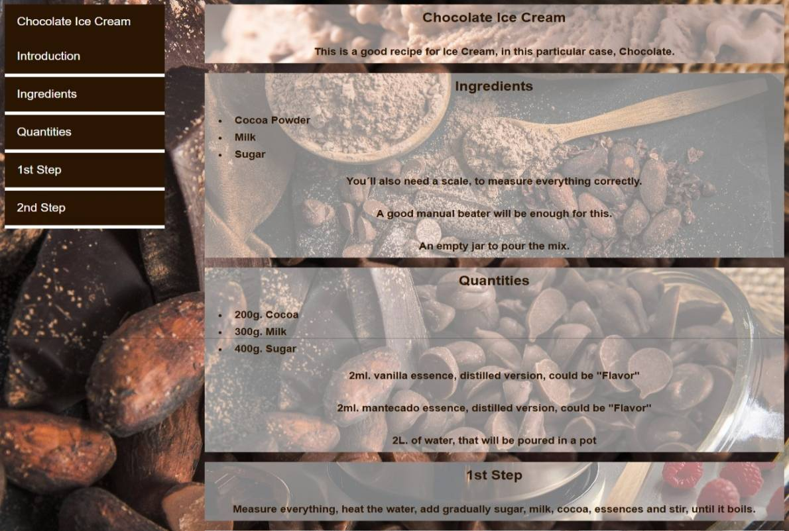

# Chocolate Ice Cream Recipe

A simple and delicious chocolate ice cream recipe presented as a responsive web page.  
This project is part of my portfolio for the **Responsive Web Design Certification** from [freeCodeCamp](https://www.freecodecamp.org/).

## 🍫 Live Demo

[View the live site here](https://jesusesp85.github.io/chocolate-ice-cream/)

## 🛠️ Technologies Used

- HTML5
- CSS3

## 📌 Project Description

This project showcases a clean and visually appealing recipe page for homemade chocolate ice cream. It includes:

- A list of ingredients
- Step-by-step preparation instructions
- A responsive layout that works on desktop
- A rich chocolate-themed design

## 📁 Project Structure

## 📸 Screenshot

  

## 🧠 What I Learned

- Structuring semantic HTML for recipe content
- Styling with CSS for visual appeal
- Creating responsive layouts using media queries

## 📬 Contact

Created by [@Jesusesp85](https://github.com/Jesusesp85)  
Feel free to reach out with feedback or suggestions!

---

